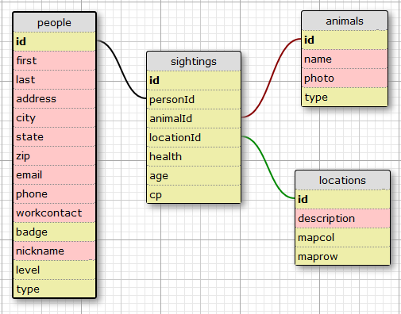

# Wildlife Tracker

by [Karen Freeman-Smith](https://github.com/karenfreemansmith)
Version 0.0.0: September 30, 2016

## Description
Final Project for Week 4, Java at Epicodus. A program to track wildlife sightings using Java, PostgreSQL, and Spark with JUnit tests demonstrating abstract classes, interfaces, many-to-many database relationships and RESTful routing.

### Specifications
#### User Stories:
* As a park ranger, I need to be able to enter sightings of wildlife that include the location and type of animal.
* As a park ranger, I need to indicate age and health for endangered animals.

#### Technical Specifications:

#### Database Diagram:

## Setup/Installation
* Clone directory
* Setup database in PSQL:
  * CREATE DATABASE wildlife_tracker;
  * \c wildlife_tracker
  * CREATE TABLE animals (id serial PRIMARY KEY, animalName varchar, photo varchar, type int, age int, health int, cp int);
  * CREATE TABLE sightings (id serial PRIMARY KEY, animalId int, personId int, locationId int);
  * CREATE TABLE people (id serial PRIMARY KEY, firstname varchar, lastname varchar, phonenumber varchar, address varchar, city varchar, state varchar, zip int, email varchar);
  * CREATE TABLE rangers (id serial PRIMARY KEY, personId int, badge int, workcontact varchar);
  * CREATE TABLE trainers (id serial PRIMARY KEY, personId int, trainerName varchar, level int);
  * CREATE TABLE locations (id serial PRIMARY KEY, description varchar, maprow int, mapcol int, time timestamp);
  * CREATE DATABASE wildlife_tracker_test WITH TEMPLATE wildlife_tracker;
* OR ... restore database from backup by running
  * CREATE DATABASE wildlife_tracker;
  * psql wildlife_tracker < db_backup.sql
  * CREATE DATABASE wildlife_tracker_test;
  * psql wildlife_tracker_test < db_backup.sql
* Type 'gradle run' inside the project directory
* Navigate to 'http://localhost:4567'

## Support & Contact
For questions, concerns, or suggestions please email karenfreemansmith@gmail.com

## Known Issues
* N/A

## Technologies Used
Java, JUnit, Spark, PostgreSQL, Gradle

## Legal
*Licensed under the GNU General Public License v3.0*

Copyright (c) 2016 Copyright _Karen Freeman-Smith_ All Rights Reserved.
